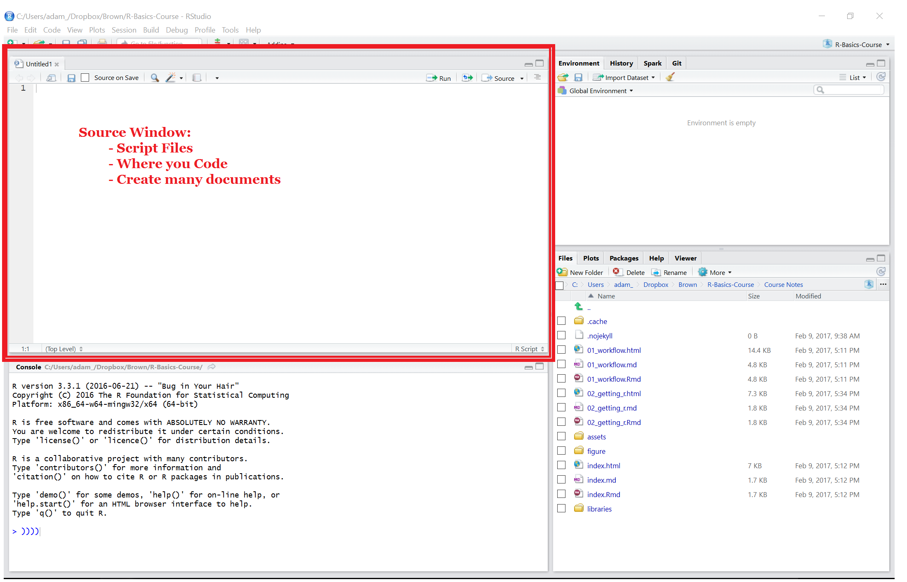
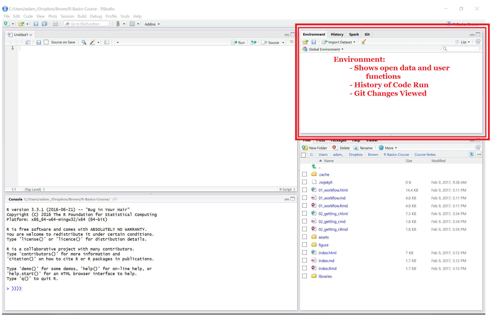

---
title       : Introduction to Statistics in R
subtitle    : "Day 1 - Getting Started with R/Basic Stats"
author      : Adam J Sullivan
job         : 
license     : by-nc-nd
framework   : io2012        # {io2012, html5slides, shower, dzslides, ...}
highlighter : highlight.js  # {highlight.js, prettify, highlight}
hitheme     : tomorrow      # 
widgets     : [mathjax, quiz, bootstrap, interactive]            # {mathjax, quiz, bootstrap}
mode        : selfcontained # {standalone, draft}
logo        : bcbi_small.png
biglogo     : shield_image_large2.png
knit        : slidify::knit2slides
assets      : {assets: ../../assets}
---  .segue bg:grey

# Ways to Use R

--- .class #id

## Base R


<center>

</center>


--- .class #id

## RStudio


<center>

</center>

--- .class #id


## RStudio


<center>

</center>

--- .class #id
 
## RStudio


<center>

</center>


--- .class #id
 
## RStudio


<center>

</center>


--- .class #id
 
## RStudio


<center>

</center>


---  .segue bg:grey

# Using R as a Calculator


---  .class #id


## Arithmetic Operators

Operator        |   Description
--------------- | --------------------
`+`             |    Addition 
`-`             |   Subtraction
`*`             |    Multiplication
`/`             |    Division
^ or `**`       |    Exponentiation

---  .class #id

## R as a Calculator

The most simple procedures that we can do in R is using R as a calculator. For example:


```r
# Addition
5+4
```

```
## [1] 9
```

```r
# Subtraction
124 - 26.82 
```

```
## [1] 97.18
```

---  .class #id

## R as a Calculator


```r
# Multiplication
5*4
```

```
## [1] 20
```

```r
# Division
35/8
```

```
## [1] 4.375
```

---  .class #id

## More Math in R

R works simply as a calculator but also can be used for more advanced operations as well. 


```r
# Exponentials
3^(1/2)
```

```
## [1] 1.732051
```

```r
# Exponential Function
exp(1.5)
```

```
## [1] 4.481689
```

---  .class #id

## More Math in R


```r
# Log base e
log(4.481689)
```

```
## [1] 1.5
```

```r
# Log base 10
log10(1000)
```

```
## [1] 3
```

---  .class #id

## Logical Operators

Once we have used some basic arithmetic operators we move into logic. 


 Operator  |  Description
---------- | ------------------------------
  `<`      |  Less Than
  `>`      |    Greater Than
  `<=`     |   Less Than or Equal To
  `>=`     |    Greater Than or Equal To
 `==`     |  Exactly Equal To
 `!=`      |   Not Equal To
 `!a`      |  Not `a`
 `a&b`    |  `a` **AND** `b`


--- .class #id

## Logic in R Example 

We can then see an example of this:


```r
a <- c(1:12)
# a>9 OR a<4
# Gives us 1 2 3 10 11 12

#Having R do this
a
```

```
##  [1]  1  2  3  4  5  6  7  8  9 10 11 12
```

```r
a>9
```

```
##  [1] FALSE FALSE FALSE FALSE FALSE FALSE FALSE FALSE FALSE  TRUE  TRUE
## [12]  TRUE
```

--- .class #id

## Logic in R Example


```r
a<4
```

```
##  [1]  TRUE  TRUE  TRUE FALSE FALSE FALSE FALSE FALSE FALSE FALSE FALSE
## [12] FALSE
```

```r
a>9 | a<4
```

```
##  [1]  TRUE  TRUE  TRUE FALSE FALSE FALSE FALSE FALSE FALSE  TRUE  TRUE
## [12]  TRUE
```

```r
a[a>9 | a<4]
```

```
## [1]  1  2  3 10 11 12
```

--- .class #id

## Further Operators

Some other operators we may want to use are listed below


Description                |  R Symbol  |    Example
-------------------------- | ---------- | -----------------------
 Comment                  |    #        |  \# This is a comment
 Assignment               |     `<-`       |   x `<-` 5
 Assignment                |    `->`       |  5 `->` x
 Assignment                |    `=`        |  x `=` 5
 Concatenation operator    |  c          |  c(1,2,4)
 Modular                  |    \%\%     |      25 \%\% 6
 Sequence from a to b by h |   seq       |   seq(a,b,h)
 Sequence Operator          |    :      |     0:3

--- .class #id

## Math Functions in R

We also have access to a wide variety of mathematical functions that are already built into R. 

  Description               |    R Symbol
--------------------------- | ------------------
Square Root                 |    `sqrt`
`floor(x)`                 |    `floor` 
`\ceil(x)`                |   `ceiling`
Logarithm                   |    `log`
Exponential function, `e^x`  |   `exp`
Factorial, `!`                |  `factorial`

---  .segue bg:grey

# Getting Help in R


--- class $id

## The `help()` Function

- To get online help within an R session we use the `help()` function. 
- For example if we want to create a sequence and know that we can use the function `seq()` but are unsure of the arguments


--- class $id

## Help Function Example


```r
# help() function with seq as argument
help(seq)

# Shortcut for help() is ?
?seq
```

--- class $id

## Further Help Funcion Use

We can also get help on characters and words by placing them in quotations


```r
#Special characters < (all of these display the same information)
help("<")
help('<')
?"<"
?'<'

# Help for words (same use of quotations above work
?"for"
```

--- class $id

## The `example()` Function

- Many times we just need to see some examples rather than read the entire documentation of a function or command.
- In this situation we would use the `example()` function


```r
example(seq)
```

--- class $id

## The `example()` Function

- We can then see numerous examples that R has run for us. 
- The benefit of this command comes when you are interested in seeing examples of graphics, where just seeing the command and not the final product may not be as intuitive for us


```r
#Example of Perspective Plots
example(persp)
```

--- class $id


## The `help.search()` Function

The other help items are great if you know what function you are looking for. Many times we do not know exactly what we are looking for and need to do a more comprehensive search to find a proper function. 


```r
#Search for information about normal
help.search("normal")
```


---  .segue bg:grey

# Importing Data into R

--- .class #id

## Ways to get Data into R?

We use

- Built in Data
- .csv, .txt. .xls, ....
- SPSS, SAS, Stata
- Web Scraping
- Databases


--- .class #id

## Built in Data

- R has a wealth of data built in.
- We can use `data()` function to find it


--- .class #id

## Built in Data

- List all Datasets

```r
data()
```
- Specific packages data

```r
data(package="tidyr")
```


--- .class #id

## Delimited Files

- There are many packages out there which handle all of these things. 
- We will stick to using the tidyverse packages. 
- This will provide consistency with all we do. 

--- .class #id

## `readr` in Tidyverse

- `readr` is a collection of many functions
    - `read_csv()`: comma separated (CSV) files
    - `read_tsv()`: tab separated files
    - `read_delim()`: general delimited files
    - `read_fwf()`: fixed width files
    - `read_table()`: tabular files where columns are separated by white-space.
    - `read_log()`: web log files
- `readxl` reads in Excel files. 

--- .class#id

## Reading Delimited Files

- Many files are separated by delimiters. 
- Common Ones are
    - comma (`,`)
    - semi-colon (`;`)
    - tab (  or `\t` )
- We can use various functions to read these files in. 

--- .class#id

## Reading Delimited Files

- In the third session we will use the following functions in practice:
    - `read.csv()`
    - `read.delim()`

--- .class #id

## Importing From Other Software

- R can read files from many other software types.
    - SAS
    - Stata
    - SPSS


--- .class #id

## Enter Haven Package

- `haven` is part of tidyverse.
- It contains the functions to read many different files.
- It can also write to those same data types. 

--- .class #id

## For SAS

```
read_sas(data_file, catalog_file = NULL, encoding = NULL)

write_sas(data, path)
```

--- .class #id

## For Stata

```
read_dta(file, encoding = NULL)

read_stata(file, encoding = NULL)

write_dta(data, path, version = 14)
```

--- .class #id

## For SPSS

```
read_sav(file, user_na = FALSE)

read_por(file, user_na = FALSE)

write_sav(data, path)

read_spss(file, user_na = FALSE)
```


--- .segue bg:grey

# Tibbles in R


--- .class #id


## Tibbles

Previously we have worked with data in the form of

- Vectors
- Lists
- Arrays
- Dataframes

--- .class #id


## Tibbles

- *"Tibbles"* are a new modern data frame.  
- It keeps many important features of the original data frame. 
- It removes many of the outdated features. 

--- .class #id

## Compared to Data Frames

- A *tibble* never changes the input type. 
    - No more worry of characters being automatically turned into strings. 
- A tibble can have columns that are lists.
- A tibble can have non-standard variable names.
    - can start with a number or contain spaces. 
    - To use this refer to these in a backtick.
- It only recycles vectors of length 1. 
- It never creates row names.

--- .class #id


## Column-Lists


```r
library(tidyverse)
## Warning: package 'tidyverse' was built under R version 3.3.2
## Warning: package 'ggplot2' was built under R version 3.3.2
## Warning: package 'tidyr' was built under R version 3.3.2
try <- tibble(x = 1:3, y = list(1:5, 1:10, 1:20))
try 
## # A tibble: 3 × 2
##       x          y
##   <int>     <list>
## 1     1  <int [5]>
## 2     2 <int [10]>
## 3     3 <int [20]>


#try <- as_data_frame(c(x = 1:3, y = list(1:5, 1:10, 1:20)))
#try
# Leads to error
```

--- .class #id


## Non-Standard Names


```r
names(data.frame(`crazy name` = 1))
## [1] "crazy.name"
names(tibble(`crazy name` = 1))
## [1] "crazy name"
```

--- .class #id

## Coercing into Tibbles

- A tibble can be made by coercing `as_tibble()`. 
- This works similar to `as.data.frame()`.
- It works efficiently.

--- .class #id


## Coercing into Tibbles


```r
l <- replicate(26, sample(100), simplify = FALSE)
names(l) <- letters

microbenchmark::microbenchmark(
  as_tibble(l),
  as.data.frame(l)
)
## Unit: microseconds
##              expr      min       lq     mean    median        uq      max
##      as_tibble(l)  299.879  337.363  385.665  368.3775  411.6635  775.132
##  as.data.frame(l) 1357.485 1504.300 1747.447 1578.1535 1826.2675 3112.575
##  neval cld
##    100  a 
##    100   b
```

--- .class #id

## Tibbles vs Data Frames

There are a couple key differences between tibbles and data frames. 

- Printing.
- Subsetting. 

--- .class #id

## Printing

- Tibbles only print the first 10 rows and all the columns that fit on a screen. - Each column displays its data type. 
- You will not accidentally print too much. 

```
tibble(
  a = lubridate::now() + runif(1e3) * 86400,
  b = lubridate::today() + runif(1e3) * 30,
  c = 1:1e3,
  d = runif(1e3),
  e = sample(letters, 1e3, replace = TRUE)
)
```


--- .class #id

## Printing

```r

## # A tibble: 1,000 x 5
##                      a          b     c          d     e
##                 <dttm>     <date> <int>      <dbl> <chr>
## 1  2017-02-18 05:28:37 2017-03-08     1 0.02150370     f
## 2  2017-02-17 22:08:24 2017-03-08     2 0.08031493     k
## 3  2017-02-18 02:03:13 2017-03-07     3 0.11670172     u
## 4  2017-02-18 15:16:10 2017-03-08     4 0.24552337     h
## 5  2017-02-18 00:41:20 2017-03-04     5 0.11232662     b
## 6  2017-02-18 06:26:41 2017-03-08     6 0.52834632     m
## 7  2017-02-18 10:08:57 2017-03-15     7 0.78928491     v
## 8  2017-02-18 13:28:41 2017-03-15     8 0.80388276     h
## 9  2017-02-18 11:35:47 2017-03-18     9 0.45767339     d
## 10 2017-02-18 05:40:18 2017-02-24    10 0.18177950     t
## # ... with 990 more rows
```

--- .class #id


## Subsetting


- We can index a tibble in the manners we are used to
    - `df$x`
    - `df[["x"]]`
    - `df[[1]]`
- We can also use a `pipe` which we will learn about later.
    - `df %>% .$x`
    - `df %>% .[["x"]]`

--- .class #id

## Subsetting


```r
df <- tibble(
  x = runif(5),
  y = rnorm(5)
)

df$x
## [1] 0.6227033 0.7363213 0.8551199 0.9173554 0.5542486
df[["x"]]
## [1] 0.6227033 0.7363213 0.8551199 0.9173554 0.5542486
df[[1]]
## [1] 0.6227033 0.7363213 0.8551199 0.9173554 0.5542486
```

--- .class #id

## Subsetting


```r
df %>% .$x
## [1] 0.6227033 0.7363213 0.8551199 0.9173554 0.5542486
df %>% .[["x"]]
## [1] 0.6227033 0.7363213 0.8551199 0.9173554 0.5542486
df %>% .[[1]]
## [1] 0.6227033 0.7363213 0.8551199 0.9173554 0.5542486
```


---  .segue bg:grey


# Piping or Chaining Data


--- .class #id

## Piping or Chaining

- We will discuss a concept that will help us greatly when it comes to working with our data. 
- The usual way to perform multiple operations in one line is by nesting. 

--- .class #id

## Piping or Chaining

To consider an example we will look at the data provided in the 'fivethirtyeight' package:


```r
library(fivethirtyeight)
drinks
```

```
## # A tibble: 193 x 5
##    country           beer_servings spirit_servings wine_servings total_li~
##    <chr>                     <int>           <int>         <int>     <dbl>
##  1 Afghanistan                   0               0             0     0    
##  2 Albania                      89             132            54     4.90 
##  3 Algeria                      25               0            14     0.700
##  4 Andorra                     245             138           312    12.4  
##  5 Angola                      217              57            45     5.90 
##  6 Antigua & Barbuda           102             128            45     4.90 
##  7 Argentina                   193              25           221     8.30 
##  8 Armenia                      21             179            11     3.80 
##  9 Australia                   261              72           212    10.4  
## 10 Austria                     279              75           191     9.70 
## # ... with 183 more rows
```

--- .class #id

## Nesting vs Chaining

- Let's say that we want to consider the  beer and wine drinking habits of Australia.
- Traditionally speaking we could do this in a nested manner:


```r
filter(select(drinks, country, beer_servings, wine_servings), country=="Australia")
```

--- .class #id

## Nesting vs Chaining

- It is not easy to see exactly what this code was doing but we can write this in a manner that follows our logic much better. 
- The code below represents how to do this with chaining. 


```r
drinks %>%
    select(country, beer_servings, wine_servings) %>%
    filter(country=="Australia")
```

--- .class #id

## Breaking Down the Code

- We now have something that is much clearer to read.
- Here is what our chaining command says:

1. Take the `drinks` data
2. Select the variables: `country`, `beer_servings` and `wine_servings`.
3. Only keep information from Australia.

- The nested code says the same thing but it is hard to see what is going on if you have not been coding for very long.


--- .class #id

## Breaking Down the Code

- The result of this search is below: 


```
## # A tibble: 1 x 3
##   country   beer_servings wine_servings
##   <chr>             <int>         <int>
## 1 Australia           261           212
```

--- .class #id

## What is `%>%`

- In the previous code we saw that we used `%>%` in the command you can think of this as saying ***then***.
- For example:


```r
drinks %>%
    select(country, beer_servings, wine_servings) %>%
    filter(country=="Australia")
```

--- .class #id

## What Does this Mean?

- This translates to:
    - Take drinks ***then*** select these columns country, beer_servings, wine_servings ***then*** filter out so we only keep Australia.


--- .class #id

## Why Chain?

- We still might ask why we would want to do this. 
- Chaining increases readability significantly when there are many commands. 
- With many packages we can replace the need to perform nested arguments. 
- The chaining operator is automatically imported from the [magrittr](https://github.com/smbache/magrittr) package. 

--- .class #id

## User Defined Function


- Let's say that we wish to find the Euclidean distance between two vectors say, `x1` and `x2`. 
- We could use the math formula:

\[\sqrt{sum(x1-x2)^2}\]

--- .class #id

## User Defined Function

- In the nested manner this would be:


```r
x1 <- 1:5; x2 <- 2:6
sqrt(sum((x1-x2)^2))
```

--- .class #id

## User Defined Function


- However, if we chain this we can see how we would perform this mathematically. 

```r
# chaining method
(x1-x2)^2 %>% sum() %>% sqrt()
```
- If we did it by hand we would perform elementwise subtraction of `x2` from `x1` ***then*** we would sum those elementwise values ***then*** we would take the square root of the sum. 


--- .class #id

## User Defined Function


```r
# chaining method
(x1-x2)^2 %>% sum() %>% sqrt()
```

```
## [1] 2.236068
```

- Many of us have been performing calculations by this type of method for years, so that chaining really is more natural for us. 

--- .class #id

## User Defined Function

In the nested manner this would be:


```r
x1 <- 1:5; x2 <- 2:6
sqrt(sum((x1-x2)^2))
```

However, if we chain this we can see how we would perform this mathematically. 


```r
# chaining method
(x1-x2)^2 %>% sum() %>% sqrt()
```


If we did it by hand we would perform elementwise subtraction of `x2` from `x1` ***then*** we would sum those elementwise values ***then*** we would take the square root of the sum. 

--- .class #id

## User Defined Function


```r
# chaining method
(x1-x2)^2 %>% sum() %>% sqrt()
```

```
## [1] 2.236068
```

Many of us have been performing calculations by this type of method for years, so that chaining really is more natural for us. 

---  .segue bg:grey

# The `dplyr` Package

--- .class #id

## The `dplyr` Package

- We will begin with how we can start to manipulate data. 
- We may wish to add additional variables.
- Perhaps we also wish to only look at data that meets a certain requirement. 
- The `dplyr` package allows us to further work with our data. 

--- .class #id

## `dplyr` Functionality

- With `dplyr` we have five basic verbs that we will learn to work with:
    - `filter()`
    - `select()`
    - `arrange()`
    - `mutate()`
    - `summarize()`

--- .class #id

## Data We will Use

- For the purposes of this example we will consider looking at the package `fivethirtyeight`. 
- We also will be using the `dyplr` package from `tidyverse`:


```r
library(dplyr)
library(fivethirtyeight)
```


--- .class #id


## Filtering 


- At this point we will consider how we pick the rows of the data that we wish to work with. 
- If you consider many modern data sets, we have so much information that we may not want to bring it all in at once. 
-  We have not discussed exactly how R works at this point, however R brings data into the RAM of your computer. 
- This means you can be limited for what size data you can bring in at once. 
- Very rarely do you need the entire data set. 
- We will focus on how to pick the rows or observations we want now.

--- .class #id

## Enter the `filter()` Function

- The `filter()` function chooses rows that meet a specific criteria. 
- We can do this with Base R functions or with   dplyr`.

--- .class #id

## The Data

- Lets consider the the data from the story:
-  [41 Percent Of Fliers Think You're Rude If You Recline Your Seat](https://fivethirtyeight.com/features/airplane-etiquette-recline-seat/). 
- This FiveThirtyEight data contains the following variables:


| Variable | Description |
| -------- | ------------------------------------------------------------------------------ | 
| respondent_id |  RespondentID | 
 | gender |  Gender | 
 | age  | Age | 
 | height  | Height | 
 | children_under_18  | Do you have any children under 18? | 
 | household_income  | Household income bracket | 
 | education  | Education Level | 
 | location |  Location (census region) | 
 | frequency |  How often do you travel by plane? | 
 | recline_frequency |  Do you ever recline your seat when you fly? | 
 | recline_obligation  | Under normal circumstances, does a person who reclines their seat during a  flight have any obligation to the person sitting behind them? |
 | recline_rude |  Is it rude to recline your seat on a plane? | 
 | recline_eliminate |  Given the opportunity, would you eliminate the possibility of reclining seats on planes entirely? | 
 | switch_seats_friends |  Is it rude to ask someone to switch seats with you in order to be closer to friends? | 
| switch_seats_family | Is it rude to ask someone to switch seats with you in order to be closer to family? |
 | wake_up_bathroom  | Is it rude to wake a passenger up if you are trying to go to the bathroom? | 
 | wake_up_walk  | Is it rude to wake a passenger up if you are trying to walk around? | 
 | baby |  In general, is it rude to bring a baby on a plane? | 
 | unruly_child |  In general, is it rude to knowingly bring unruly children on a plane? | 
 | two_arm_rests |  In a row of three seats, who should get to use the two arm rests? | 
 | middle_arm_rest |  In a row of two seats, who should get to use the middle arm rest? | 
 | shade |  Who should have control over the window shade? | 
 | unsold_seat  | Is it rude to move to an unsold seat on a plane? | 
| talk_stranger |  Generally speaking, is it rude to say more than a few words to the stranger sitting next to you on a plane? | 
| get_up |  On a 6 hour flight from NYC to LA, how many times is it acceptable to get up if you're not in an aisle seat?  | 
| electronics |  Have you ever used personal electronics during take off or landing in violation of a flight attendant's direction?  | 
| smoked  | Have you ever smoked a cigarette in an airplane bathroom when it was against the rules? | 

 
--- .class #id

## Indexing

- Let's say you only wanted to see information from people who never recline their seats.  
- We could do this in what is called the indexing method.    


```r
library(fivethirtyeight)
flying[recline_frequency=="Never",]
```

Now this is not very difficult to do, what we have is that we are working with `flying` and we only want to keep the rows of data there `recline_frequency=="Never"`. 


--- .class #id

## Indexing


```
## Error in `[.tbl_df`(flying, recline_frequency == "Never", ): object 'recline_frequency' not found
```


--- .class #id

## Renaming Columns

- Many times we may wish to rename a column so that it makes more sense to us.
-  The `select()` function can rename things for us as well. 
- For example, there is a variable called `gender` in the `flying` data. 
- This actually refers to binary sex and not what we know as gender. We could rename this to be:


```r
flying %>%
  select(sex = gender)
```

--- .class #id

## Renaming Columns


```
## # A tibble: 1,040 x 1
##    sex  
##    <chr>
##  1 <NA> 
##  2 Male 
##  3 Male 
##  4 Male 
##  5 Male 
##  6 Male 
##  7 Male 
##  8 Male 
##  9 <NA> 
## 10 Male 
## # ... with 1,030 more rows
```

--- .class #id

## Renaming Columns

- Note: We only kept the column of data that we renamed. If we had wanted to keep everything we could have used:


```r
 flying %>%
  select(sex = gender, everything())
```

--- .class #id

## Renaming Columns


--- .class #id

## Unique Observations

- Many times we have a lot of repeats in our data. 
- If we just would like to have an account of all things included then we can use the `unique()` command. 
- Let's assume that we just want each census region accounted for


```r
flying %>% 
  select(location) %>% 
  unique()
```

--- .class #id

## Unique Observations


```
## # A tibble: 10 x 1
##    location          
##    <chr>             
##  1 <NA>              
##  2 Pacific           
##  3 East North Central
##  4 New England       
##  5 Mountain          
##  6 South Atlantic    
##  7 East South Central
##  8 Middle Atlantic   
##  9 West North Central
## 10 West South Central
```

--- .class #id

## Arranging the Data

- We also have need to make sure the data is ordered in a certain manner. 
- This can be easily done in R with the `arrange()` function. 
- Again we can do this in base R but this is not always a clear path. 

--- .class #id

## Arranging the Data

- Let's say that we wish to look at only sex and frequency and we wish to order frequency from smallest to largest. 
- In base R we would have to run the following command:
  


```r
flying[order(flying$frequency), c("sex", "frequency")]
```


In this command we are ordering the rows by `frequency` and then only keeping `sex` and `frequency` in the end. 

--- .class #id

## Enter the `arrange()` Function

We could do this in an easy manner using the  `arrange()` function:

```
arrange(.data, ...)
```

Where

- `.data` is a data frame of interest.
- `...` are the variables you wish to sort by. 

--- .class #id

## Arrange Function Example


```r
flying %>%
    select(sex, frequency) %>%
    arrange(frequency)
```


--- .class #id

## Arrange Function Example


```
## # A tibble: 1,040 x 2
##    sex   frequency
##    <chr> <fctr>   
##  1 Male  Never    
##  2 Male  Never    
##  3 Male  Never    
##  4 Male  Never    
##  5 Male  Never    
##  6 Male  Never    
##  7 Male  Never    
##  8 Male  Never    
##  9 Male  Never    
## 10 Male  Never    
## # ... with 1,030 more rows
```


--- .class #id

## Arrange Function Descending Example


- With `arrange()` we first use `select()` to pick the only columns that we want and then we arrange by the `dep_delay`. 
- If we had wished to order them in a descending manner we could have simply used the `desc()` function:


```r
flying %>%
    select(sex, frequency) %>%
    arrange(desc(frequency))
```


--- .class #id

## Arrange Function Descending Example


```
## # A tibble: 1,040 x 2
##    sex    frequency            
##    <chr>  <fctr>               
##  1 Male   Every day            
##  2 Female Every day            
##  3 Male   Every day            
##  4 <NA>   A few times per week 
##  5 <NA>   A few times per week 
##  6 Male   A few times per week 
##  7 Male   A few times per week 
##  8 Male   A few times per month
##  9 Male   A few times per month
## 10 Male   A few times per month
## # ... with 1,030 more rows
```


--- .class #id

## More Complex Arrange

- Lets consider the a scenario where we want to look at people from each sex in each location and only consider the 3 highest when ranked by age. 
- We then need to do the following:

1. Group by sex and location
2. Pick the top 3 ages
3. order them largest to smallest

--- .class #id

## More Complex Arrange


This can be done in the following manner:


```r
flying %>% 
  group_by(sex, location) %>%  
  top_n(3, age) %>% 
  arrange(desc(age))
```


--- .class #id

## More Complex Arrange


```
## # A tibble: 263 x 27
## # Groups: sex, location [20]
##    sex   respon~ age    height child~ hous~ educa~ loca~ freq~ recl~ recl~
##    <chr>   <dbl> <fctr> <fctr> <lgl>  <fct> <fctr> <chr> <fct> <fct> <lgl>
##  1 Male   3.43e9 > 60   "5'9\~ F      $50,~ Bache~ East~ Once~ Once~ T    
##  2 Male   3.43e9 > 60   "6'5\~ F      $50,~ Bache~ West~ Once~ Never T    
##  3 Male   3.43e9 > 60   "5'11~ F      $50,~ Some ~ West~ Once~ Alwa~ F    
##  4 Male   3.43e9 > 60   "5'8\~ F      <NA>  Gradu~ Moun~ Once~ Never F    
##  5 Male   3.43e9 > 60   "5'8\~ F      $100~ Some ~ West~ Once~ Abou~ F    
##  6 Male   3.43e9 > 60   "5'7\~ F      $100~ Bache~ Moun~ Once~ Once~ F    
##  7 Male   3.43e9 > 60   <NA>   NA     <NA>  Some ~ Midd~ Never <NA>  NA   
##  8 Male   3.43e9 > 60   "5'11~ F      <NA>  Gradu~ Midd~ Once~ Once~ F    
##  9 Male   3.43e9 > 60   "5'10~ F      <NA>  Bache~ Paci~ Once~ Once~ T    
## 10 Male   3.43e9 > 60   "5'9\~ F      <NA>  Gradu~ Midd~ Once~ Never T    
## # ... with 253 more rows, and 16 more variables: recline_rude <fctr>,
## #   recline_eliminate <lgl>, switch_seats_friends <fctr>,
## #   switch_seats_family <fctr>, wake_up_bathroom <fctr>, wake_up_walk
## #   <fctr>, baby <fctr>, unruly_child <fctr>, two_arm_rests <chr>,
## #   middle_arm_rest <chr>, shade <chr>, unsold_seat <fctr>, talk_stranger
## #   <fctr>, get_up <fctr>, electronics <lgl>, smoked <lgl>
```


--- .class #id


## Summarizing Data

- As you have seen in your own work, being able to summarize information is crucial. 
- We need to be able to take out data and summarize it as well. 
- We will consider doing this using the `summarise()` function. 


--- .class #id


## Summarizing Data Example 

Lets say we wish to:

1. Create a table grouped by `location`.
2. Summarize each group by taking mean of `recline_frequency`.


--- .class #id


## Summarizing Data Example Base R


```r
head(with(flying, tapply(as.numeric(recline_frequency), location, mean, na.rm=TRUE)))
head(aggregate(as.numeric(recline_frequency)~location, flying, mean))
```


--- .class #id


```
## East North Central East South Central    Middle Atlantic 
##           2.647541           2.960000           3.090090 
##           Mountain        New England            Pacific 
##           2.629630           2.854545           3.021622
```

```
##             location as.numeric(recline_frequency)
## 1 East North Central                      2.647541
## 2 East South Central                      2.960000
## 3    Middle Atlantic                      3.090090
## 4           Mountain                      2.629630
## 5        New England                      2.854545
## 6            Pacific                      3.021622
```


--- .class #id


## Enter `summarise()` Function

The `summarise()` function is:

```
summarise(.data, ...)
```

where

- `.data` is the tibble of interest.
- `...` is a list of name paired summary functions
  - Such as:
      - `mean()`
      - `median`
      - `var()`
      - `sd()`
      - `min()`
      - `max()
      - ...

*Note: `summarise()` is Primarily useful with data that has been grouped by one or more variables*.


--- .class #id

## Summarise Function Example

Our example:


```
flying %>%
    group_by(location) %>%
    summarise(avg_recline = mean(as.numeric(recline_frequency), na.rm=TRUE))
```

Consider the logic here:

1. Group observations by location.
2. Find the average recline frequency of the groups and call it `avg_recline`.


--- .class #id

## Summarise Function Example

This is much easier to understand than the  Base R code and yields the table below:


```
## # A tibble: 10 x 2
##    location           avg_recline
##    <chr>                    <dbl>
##  1 East North Central        2.65
##  2 East South Central        2.96
##  3 Middle Atlantic           3.09
##  4 Mountain                  2.63
##  5 New England               2.85
##  6 Pacific                   3.02
##  7 South Atlantic            2.67
##  8 West North Central        2.68
##  9 West South Central        2.70
## 10 <NA>                      2.95
```


--- .class #id

## Another Example

Lets say that we would like to have more than just the averages but we wish to have the minimum and the maximum ages by location and:


```r
flying %>%
    group_by(sex, location) %>%
    mutate(age_num = as.numeric(age)) %>%
    summarise_each(funs(min(., na.rm=TRUE), max(., na.rm=TRUE)), "age_num")
```

--- .class #id

## Another Example


```
## # A tibble: 21 x 4
## # Groups: sex [?]
##    sex    location           age_num_min age_num_max
##    <chr>  <chr>                    <dbl>       <dbl>
##  1 Female East North Central        1.00        4.00
##  2 Female East South Central        1.00        4.00
##  3 Female Middle Atlantic           1.00        4.00
##  4 Female Mountain                  1.00        4.00
##  5 Female New England               1.00        4.00
##  6 Female Pacific                   1.00        4.00
##  7 Female South Atlantic            1.00        4.00
##  8 Female West North Central        1.00        4.00
##  9 Female West South Central        1.00        4.00
## 10 Female <NA>                      2.00        4.00
## # ... with 11 more rows
```


--- .class #id


## Counting Events

There are various helper functions that we can use to count rows in a group. We will consider the following:

- `n()`
- `tally()`
- `n_distinct()`


--- .class #id

## Counting Events

Let's consider counting how many people are missing information on smoking when broken down by age and location. 


```r
flying %>%
    group_by(age, location) %>%
    summarise(person_count = n()) %>%
    arrange(desc(person_count))
```


--- .class #id

## Counting Events


```
## # A tibble: 41 x 3
## # Groups: age [5]
##    age    location           person_count
##    <fctr> <chr>                     <int>
##  1 30-44  Pacific                      60
##  2 18-29  Pacific                      56
##  3 > 60   Pacific                      54
##  4 > 60   South Atlantic               51
##  5 45-60  Middle Atlantic              48
##  6 45-60  Pacific                      48
##  7 45-60  South Atlantic               48
##  8 30-44  East North Central           42
##  9 45-60  East North Central           42
## 10 18-29  South Atlantic               38
## # ... with 31 more rows
```


--- .class #id

## Counting Events


We could also have used what is called the  `tally()` function:


```r
flying %>%
    group_by(age, location) %>%
    tally(sort = TRUE)
```

--- .class #id

## Counting Events


```
## # A tibble: 41 x 3
## # Groups: age [5]
##    age    location               n
##    <fctr> <chr>              <int>
##  1 30-44  Pacific               60
##  2 18-29  Pacific               56
##  3 > 60   Pacific               54
##  4 > 60   South Atlantic        51
##  5 45-60  Middle Atlantic       48
##  6 45-60  Pacific               48
##  7 45-60  South Atlantic        48
##  8 30-44  East North Central    42
##  9 45-60  East North Central    42
## 10 18-29  South Atlantic        38
## # ... with 31 more rows
```


--- .class #id

## Counting Unique Items

- The last way to count is if we want to find unique items. 
- So we could look for one observation per age range and location that discusses how often one should get up during a flight. 


```r
flying %>%
    group_by(age,location) %>%
    summarise(person_count = n(), get_up_unique = n_distinct(get_up))
```


--- .class #id

## Counting Unique Items


```
## # A tibble: 41 x 4
## # Groups: age [?]
##    age    location           person_count get_up_unique
##    <fctr> <chr>                     <int>         <int>
##  1 18-29  East North Central           33             6
##  2 18-29  East South Central            7             3
##  3 18-29  Middle Atlantic              22             7
##  4 18-29  Mountain                     15             6
##  5 18-29  New England                  12             7
##  6 18-29  Pacific                      56             7
##  7 18-29  South Atlantic               38             6
##  8 18-29  West North Central           17             4
##  9 18-29  West South Central           19             6
## 10 18-29  <NA>                          1             1
## # ... with 31 more rows
```


--- .class #id

## Adding New Variables


- There is usually no way around needing a new variable in your data. 
- For example, most medical studies have height and weight in them, however many times what a researcher is interested in using is Body Mass Index (BMI).
- We would need to add BMI in. 


Using the `tidyverse` we can add new variables in multiple ways

- `mutate()`
- `transmute()`


--- .class #id


## The Mutate Function

With `mutate()` we have

```
mutate(.data, ...)
```

where

- `.data` is your tibble of interest.
- `...` is the name paired with an expression


--- .class #id

## The transmute Function

Then with `transmute()` we have:

```
transmute(.data, ...)
```

where

- `.data` is your tibble of interest.
- `...` is the name paired with an expression


--- .class #id

## Differences Between `mutate()` and `transmute()`

- There is only one major difference between `mutate()` and `transmutate` and that is what it keeps in your data. 
- `mutate()`
    - creates a new variable
    - It keeps all existing variables
- `transmute()`
   - creates a new variable.
   - It only keeps the new variables


--- .class #id


## Mutate and Transmute Example


- Let's consider another dataset on drinking habits.
- Let's say we want to  create a ratio of beer drinking to wine drinking. We can do this by:


\[\text{beer to wine ratio} = \dfrac{\text{beer servings}}{\text{wine servings}}\]


--- .class #id


## Mutate and Transmute Example


We can first do this with `mutate()`:


```r
drinks %>% 
  select(country, beer_servings, wine_servings) %>%
  mutate(beer_2_wine = beer_servings/wine_servings)
```


--- .class #id


## Mutate and Transmute Example

Notice with `mutate()` we kept all of the variables we selected and added beer to wine ratio to this.


```
## # A tibble: 193 x 4
##    country           beer_servings wine_servings beer_2_wine
##    <chr>                     <int>         <int>       <dbl>
##  1 Afghanistan                   0             0     NaN    
##  2 Albania                      89            54       1.65 
##  3 Algeria                      25            14       1.79 
##  4 Andorra                     245           312       0.785
##  5 Angola                      217            45       4.82 
##  6 Antigua & Barbuda           102            45       2.27 
##  7 Argentina                   193           221       0.873
##  8 Armenia                      21            11       1.91 
##  9 Australia                   261           212       1.23 
## 10 Austria                     279           191       1.46 
## # ... with 183 more rows
```


--- .class #id


## Mutate and Transmute Example        
              
     
Now we can do the same with `transmute()`:


```r
drinks %>% 
  select(country, beer_servings, wine_servings) %>%
  transmute(beer_2_wine = beer_servings/wine_servings)
```


--- .class #id


## Mutate and Transmute Example        
              
     
Now we can do the same with `transmute()`:


```
## # A tibble: 193 x 1
##    beer_2_wine
##          <dbl>
##  1     NaN    
##  2       1.65 
##  3       1.79 
##  4       0.785
##  5       4.82 
##  6       2.27 
##  7       0.873
##  8       1.91 
##  9       1.23 
## 10       1.46 
## # ... with 183 more rows
```


