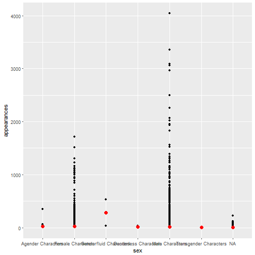
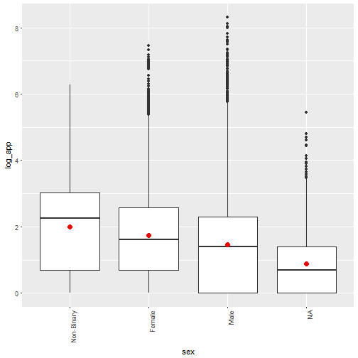
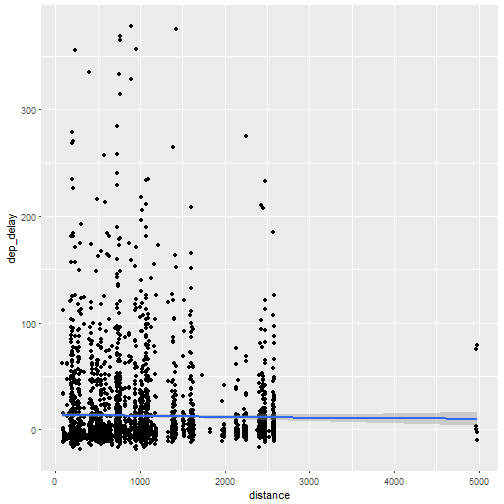

---
title       : Introduction to Statistics in R
subtitle    : "Day 3 - ANOVA"
author      : Adam J Sullivan
job         : 
license     : by-nc-nd
framework   : io2012        # {io2012, html5slides, shower, dzslides, ...}
highlighter : highlight.js  # {highlight.js, prettify, highlight}
hitheme     : tomorrow      # 
widgets     : [mathjax, quiz, bootstrap, interactive]            # {mathjax, quiz, bootstrap}
mode        : selfcontained # {standalone, draft}
logo        : bcbi_small.png
biglogo     : shield_image_large2.png
knit        : slidify::knit2slides
assets      : {assets: ../../assets}
---  .segue bg:grey


# What is ANOVA?

--- .class #id


## Recap on our progress:
  
- Up to this point we have seen basic statistical features:
  - mean
  - variance
  - standard deviation
  - median
  - min 
  - max
- We have also considered a t-test in which we compare a continuous variable across 2 groups. 

--- .class #id 

## Enter ANOVA

- What if we need to compare more than 2 groups? 
- Lets say we have the groups: A, B and C
- We could compare:
  - A vs B
  - A vs C
  - B vs C
- What are some issues with this?

--- .class #id 

## Enter ANOVA

- Multiple Testing issues
    - Each time you perform this test on the same data, you use a type 1 error of 0.05, the more tests you perfrom the more this error increases. 
    - If you need to do multiple testing you then have to do a p-value correction. 
- Could be a waste of time if all the groups are the same. 
    - More computational time if there is no difference. 


--- .class #id

## Enter ANOVA

- We then can consider ANOVA: ANalysis Of VAriance
- ANOVA asks a very basic question:
    - Where is the variability coming from?
        - Is it coming from within each group?
        - Is it coming between the groups? 
- The hypothesis test we perform is 

$$ H_0: \mu_1 = \mu_2 = \cdots = \mu_k$$ 
$$ \text{At least one group is different}$$


--- .class #id

## What is our test then? 

- We now move to testing with the $K$ distribution rather than the $t$-distribution:
- We use the following test statistic:
$$ k = \dfrac{\text{Measure of Between-Group Variability}}{\text{Measure of Within-Group Variability}}$$ 
- How do we calculate these variabilities?


--- .class #id

## The math

- We calculate the following values:
    - Between Sum of Squares
$$SS_B = \sum_{i=1}^k n_i(\bar(y)_i - \bar(y))^2$$
    - Within Sum of Squares
$$SS_W = \sum_{i=1}^k \sum_{j=1}^{n_i} (y_{ij} - \bar(y)_i)^2$$
    - Total Sums of Squares
$$SS = SS_B + SS_W$$
- In all of these: $i$ is the index for $k$ groups and $j$ is the index for the $n_i$ observations in each group. 


--- .class #id

## ANOVA Variances

- This is where the analysis of variances comes in, we are comparing the variances:
    - Between group variability
    - Within group variability
- Traditionally this test was performed using the following table:


--- .class #id 

## ANOVA Table

|                     |   DF  |    Sum Sq.   |       Mean Sq       |           F value           |  Pr(>F) |
|:-------------------:|:-----:|:------------:|:-------------------:|:---------------------------:|:-------:|
| Between (treatment) | $k-1$ |  $SS_{B}$  |      $MS_{B} = \dfrac{SS_B}{k-1}$     | $\frac{MS_{trt}}{MS_{err}}$ | p-value |
|    Within (error)   | $N-k$ | $SS_{W}$   | $MS_{W} = \dfrac{SS_W}{N-k}$ |                             |         |
|    Total  | $N-1$ | $SS_{T}$   |  |                             |         |


--- .class #id

## Calculating ANOVA

- In a traditional class you would be made to do this by hand
- We won't do this:
    1. I hate doing it. 
    2. you never do this in real life. 
    3. WE HAVE R!
- We will focus on performing this in R. 


--- .class #id

## The Data for Class

- We will consider the data behind the story: ["Comic Books are Still Made By Men, For Men and About Men"](http://fivethirtyeight.com/features/women-in-comic-books/).
- This data is part of the `fivethirtyeight` package:
- To explore the variable names run the following code:


```r
library(fivethirtyeight)
?comic_characters
```


--- .class #id


## Difference in Appearances by Gender

- Lets consider if the number of appearances of characters is different depending on the gender of the character. 
- We could first graph this:


```r
ggplot(comic_characters, aes(x = sex, y = appearances)) +
  geom_point()  + 
  geom_point(stat = "summary", fun.y = "mean", color = "red", size = 3)
```


--- .class #id

## Difference in Appearances by Gender



--- .class #id

## Table of Gender

- We can see that this is hard to read, we can see what the groups look like by counting them 


```r
comic_characters %>%
    group_by(sex) %>%
    tally(sort = TRUE)
```


--- .class #id

## Table of Gender

- We can see that this is hard to read, we can see what the groups look like by counting them 


```
## # A tibble: 7 x 2
##   sex                        n
##   <chr>                  <int>
## 1 Male Characters        16421
## 2 Female Characters       5804
## 3 <NA>                     979
## 4 Agender Characters        45
## 5 Genderless Characters     20
## 6 Genderfluid Characters     2
## 7 Transgender Characters     1
```

--- .class #id 

## Data Cleaning

- We can make the names smaller


```r
comic <- comic_characters %>%
      mutate(sex = fct_recode(sex, 
      "Agender" = "Agender Characters",
      "Female" = "Female Characters", 
      "Genderfluid" = "Genderfluid Characters",
      "Genderless" = "Genderless Characters",
      "Male" = "Male Characters",
      "Transgender" = "Transgender Characters"
      ))
```

--- .class #id

## Data Cleaning


--- .class #id 

## Cleaning Data

- we can see that we do not have many people in categories asside from "Male" and "Female"
- This can be a problem with many statistical tests so we can combine categories


```r
comic <- comic_characters %>%
      mutate(sex = fct_recode(sex, 
      "Non-Binary" = "Agender Characters",
      "Female" = "Female Characters", 
      "Non-Binary" = "Genderfluid Characters",
      "Non-Binary" = "Genderless Characters",
      "Male" = "Male Characters",
      "Non-Binary" = "Transgender Characters"
      ))
```


--- .class #id 

## Cleaning Data

- We can also see that we have a lot of values that seem to be very high compared to the mean. 
- In this case many times we pull in the extreme values with a log transform
- We can do this with mutate


```r
comic <- comic %>%
    mutate(log_app = log(appearances))
```

--- .class #id

## Boxplots

- we can then try looking at boxplots




--- .class #id 

## Finally ANOVA

- these look a little better now that we have done a log transform
- We can code an ANOVA in r with the following:
  

```r
aov(log_app~sex, data=comic)
```

```
## Call:
##    aov(formula = log_app ~ sex, data = comic)
## 
## Terms:
##                      sex Residuals
## Sum of Squares    296.09  40225.14
## Deg. of Freedom        2     20966
## 
## Residual standard error: 1.385132
## Estimated effects may be unbalanced
## 2303 observations deleted due to missingness
```


--- .class #id

## What can we do to get more information

- Many things in R are stored in objects called lists. 
- Lists contain a large amount of objects


```r
my_anova <- aov(log_app~sex, data=comic)
names(my_anova)
```

```
##  [1] "coefficients"  "residuals"     "effects"       "rank"         
##  [5] "fitted.values" "assign"        "qr"            "df.residual"  
##  [9] "na.action"     "contrasts"     "xlevels"       "call"         
## [13] "terms"         "model"
```

--- .class #id 

## Summary

- The summary function works with anova and many other functions to give us a basic summary


```r
summary(my_anova)
```

```
##                Df Sum Sq Mean Sq F value Pr(>F)    
## sex             2    296  148.05   77.16 <2e-16 ***
## Residuals   20966  40225    1.92                   
## ---
## Signif. codes:  0 '***' 0.001 '**' 0.01 '*' 0.05 '.' 0.1 ' ' 1
## 2303 observations deleted due to missingness
```


--- .class #id

## What were we testing again?

- Recall our hypothesis:
$$ H_0: \mu_1 = \mu_2 = \cdots = \mu_k$$ 
$$ \text{At least one group is different}$$
- What can we say about these groups?


--- .class #id

## What is Next?

- Now that we know there is a difference, we need to find out what difference that is. 
- This does leave us with a multiple testing problem. 
- Previously it was mentioned that performing multiple hypothesis tests we have problems with the type 1 error. 
- Type 1 error is the error of making a mistake by rejecting the null hypothesis when you shouldn't have. 
- This means that if we perform 20 studies we can assume that we made a mistake on 5% of them or 1 of them will be significant and lead to rejecting the null hypothesis. 


--- .class #id

## What about Multiple Testing

- When we perform 20 tests on the same data what we have is:
$$\begin{align*}
\Pr(\text{At least 1 Significant Result}) &= 1 - \Pr(\text{No Significant Results})\\
&= 1 - \left( 1-0.05\right)^{20}\\
& = 0.6415141
\end{align*}$$
- We call this the **Family Wise Error Rate (FWER)**
- So now we have around 13 tests that we would be making a mistake on. 
- On Friday, this will be covered more thoroughly. 


--- .class #id

## What Type of Multiple Tests for ANOVA

- We need to control the FWER so that $\text{FWER}\le0.05$. 
- There are various methods out there:
    - Bonferroni Method
    - Tukey HSD
    - Holm, Hommel, Dunnett, Šidák , ...


--- .class #id

## The Bonferroni  Correction

- Consider the problem of testing $n$ different tests. - We can do the Bonferroni in 2 different ways:
    - Adjust the significance level
$$ \alpha^*  = \dfrac{\alpha}{n}$$
    - Bonferroni Correct p-values
$$\text{min}\left[2\times\binom{k}{2}\times \Pr\left(\mid t\mid < t_{n-k}\right),1\right]$$


--- .class #id

## The Bonferroni  Correction

- If we have $n=20$ then i we wish to control the FWER at $\alpha=0.05$, then we have
$$\alpha^* = \dfrac{\alpha}{n}= \dfrac{0.05}{20}=0.0025$$
- What does this mean for the FWER:
$$\begin{align*}
\Pr(\text{At least 1 Significant Result}) &= 1 - \Pr(\text{No Significant Results})\\
&= 1 - \left( 1-0.0025\right)^{20}\\
& = 0.04883012
\end{align*}$$


--- .class #id

## Bonferonni in R

- We can perform multiple t-tests in R using:
```
pairwise.t.test(x,g,p.adjust.method,...)
```
- Where
    - `x` is the response vector
    - `g` is the grouping factor
    - `p.adjust.method` is p-value adjustment
    - `...` Others you can see in r


--- .class #id

## Bonferonni in R

- Perform multiple tests

```r
attach(comic)
pairwise.t.test(log_app,sex, p.adjust="none")
detach()
```

```
## 
## 	Pairwise comparisons using t tests with pooled SD 
## 
## data:  log_app and sex 
## 
##        Non-Binary Female
## Female 0.1283     -     
## Male   0.0023     <2e-16
## 
## P value adjustment method: none
```
- Remember to compare vs $\alpha=0.0025$


--- .class #id

## Bonferonni in R

- Or correct for Bonferroni in the p-values

```r
attach(comic)
pairwise.t.test(log_app,sex, p.adjust="bonferroni")
detach()
```

```
## 
## 	Pairwise comparisons using t tests with pooled SD 
## 
## data:  log_app and sex 
## 
##        Non-Binary Female
## Female 0.3850     -     
## Male   0.0069     <2e-16
## 
## P value adjustment method: bonferroni
```


--- .class #id

## Tukey HSD Test

- This is called the Tuker Honest Significant Difference (HSD) test.
- This creates a set of confidence intervals and adjust p-values based on the *studentized range distribution*. 
- Tukey's is usually preferred in ANOVA as it is less conservative that Bonferroni and in many cases yields and exact correction. 

--- .class #id

## Tukey HSD in R


```r
TukeyHSD(my_anova, conf.level=0.95)
```

```
##   Tukey multiple comparisons of means
##     95% family-wise confidence level
## 
## Fit: aov(formula = log_app ~ sex, data = comic)
## 
## $sex
##                         diff        lwr        upr     p adj
## Female-Non-Binary -0.2648371 -0.6730209  0.1433466 0.2811377
## Male-Non-Binary   -0.5292183 -0.9358797 -0.1225569 0.0064760
## Male-Female       -0.2643812 -0.3154401 -0.2133222 0.0000000
```

--- .class #id

## Results

- What can we confirm from these tests?


--- .class #id

## Assumptions of ANOVA

- There are assumptions made for every statistical method.
- The assumptions of ANOVA are:
    - Independent groups
    - Homogeneity of Variances
    - Normality of residuals


--- .class #id

## Testing Assumptions of ANOVA

- We test the first assumption of independence by considering the data and how it was collected.
- In our position each character only has one sex listed and they are not in other categories, thus the groups are independent. 


--- .class #id

## Testing Assumptions of ANOVA

- For testing the Homogeneity of variances we do the following:
    - Plot the Residuals
    - Perform levene test
$$\sigma^2_1=\sigma^2_2=\cdots=\sigma^2_k$$
$$\text{at least one variance is different}$$


```r
plot(my_anova, 1)

library(car)
leveneTest(log_app~sex, data = comic)
```


--- .class #id


## Testing Assumptions of ANOVA


--- .class #id


## Testing Assumptions of ANOVA


```
## Levene's Test for Homogeneity of Variance (center = median)
##          Df F value Pr(>F)
## group     2  0.1827 0.8331
##       20966
```

--- .class #id

## What if we do not have Homoscedastic Variances?


- We can relax this assumption by using a non-pooled variance:
  


```r
attach(comic)
pairwise.t.test(log_app,sex, p.adjust="bonferroni", pool.sd=FALSE)
detach()
```


--- .class #id

## Testing Assumptions of ANOVA

- For testing the normality of residuals we do the following:
    - Plot the Residuals
    - Perform Shapiro-Wilk test
$$\text{Population is Normally Distributed}$$
$$\text{Population is not Normally Distributed}$$


```r
plot(my_anova, 2)


#install.packages("nortest")
library(nortest)
lillie.test(my_anova_resid)
```

--- .class #id

## Testing Assumptions of ANOVA





--- .class #id

## Testing Assumptions of ANOVA


```
## Error in sort(x[complete.cases(x)]): object 'my_anova_resid' not found
```


--- .class #id

## What is Normality is not met?

- This requires a non-parametric test. 
- We will cover this next week. 


---  .segue bg:grey

# Questions


---  .segue bg:grey

# Lab Time


