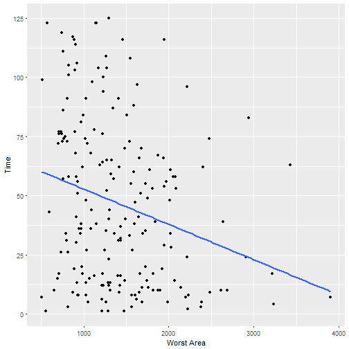
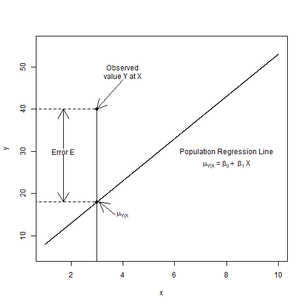
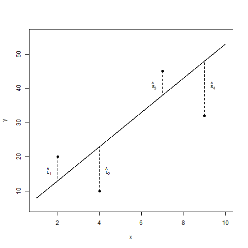
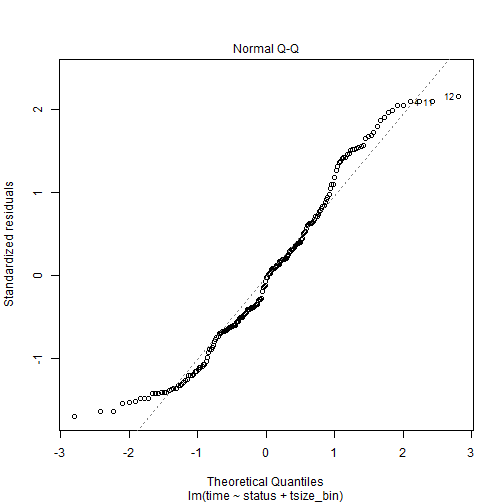
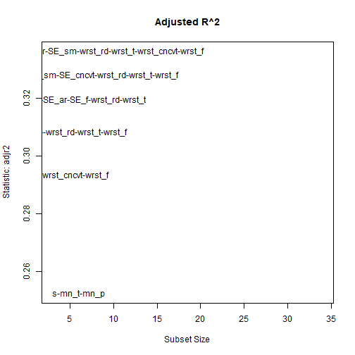
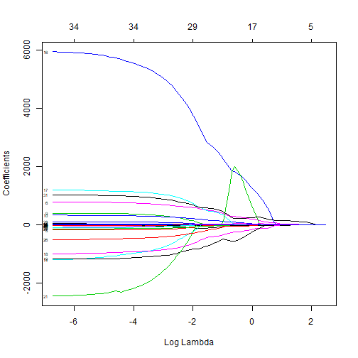

---
title       : Introduction to Statistics in R
subtitle    : "Day 5 - Linear Regression"
author      : Adam J Sullivan
job         : 
license     : by-nc-nd
framework   : io2012        # {io2012, html5slides, shower, dzslides, ...}
highlighter : highlight.js  # {highlight.js, prettify, highlight}
hitheme     : solarized      # 
widgets     : [mathjax, quiz, bootstrap, interactive]            # {mathjax, quiz, bootstrap}
mode        : selfcontained # {standalone, draft}
logo        : bcbi_small.png
biglogo     : shield_image_large2.png
knit        : slidify::knit2slides
assets      : {assets: ../../assets}
---  .segue bg:grey


# Linear Regression

--- .class #id


## Outline

1. One Categorical Covariate
2. One Continuous Covariate
3. Regression Assumptions and Diagnostics
4. Automated Regression Techniques

--- .class #id

## The Data: Wisconsin Prognostic Breast Cancer Data

- Each record represents follow-up data for one breast cancer case. 
- These are consecutive patients seen by Dr. Wolberg since 1984, and include only those cases exhibiting invasive breast cancer and no evidence of distant metastases at the time of diagnosis.
- Getting Data:
  
```
#install.packages("Th.data")
library(TH.data)
?wpbc
```


---  .segue bg:grey

# One Categorical Covariate - Binary

--- .class #id

## Binary Covariate

- With this type of covariate, we are comparing some outcome against 2 different groups. 
- In order to make these comparisons it depends on the outcome we are working with. 
- We will perform these tests based on the outcome and then use confidence intervals to assess. 

--- .class #id

## Differences in Time by Status

- Let's consider the difference in time based on the 2 statuses


```r
library(TH.data)
library(tidyverse)

cnt <- wpbc %>% 
  group_by(status) %>%
  tally()
mn<- wpbc %>% 
  group_by(status) %>%
  summarise(mean_time=mean(time))
full_join(cnt,mn)
```

```
## # A tibble: 2 x 3
##   status     n mean_time
##   <fctr> <int>     <dbl>
## 1 N        151      53.5
## 2 R         47      25.1
```

--- .class #id

## Differences in Time by Status

- We have learned how to do this previously. 
- We first did this comparison with a t-test
- Then we did this with an F-test in ANOVA


--- .class #id

## Time by Status: t-test

- Consider this with a t-test


```r
t.test(time~status, data=wpbc)
```

```
## 
## 	Welch Two Sample t-test
## 
## data:  time by status
## t = 6.514, df = 118.26, p-value = 1.865e-09
## alternative hypothesis: true difference in means is not equal to 0
## 95 percent confidence interval:
##  19.75618 37.01401
## sample estimates:
## mean in group N mean in group R 
##        53.47020        25.08511
```


--- .class #id
## Time by Status: ANOVA

- Consider with ANOVA


```r
library(broom)
tidy(aov(time~status, data=wpbc))
```

```
##        term  df     sumsq    meansq statistic      p.value
## 1    status   1  28879.54 28879.538  27.59883 3.874707e-07
## 2 Residuals 196 205095.28  1046.404        NA           NA
```


--- .class #id

## ANOVA vs t-test

- t-test and ANOVA should give us the same results.
- We can see that in our output this is not true. 
- What were the assumptions of ANOVA?


--- .class #id 

## Time by Status: t-test

- Consider this with a t-test


```r
t.test(time~status, data=wpbc, var.equal=TRUE)
```

```
## 
## 	Two Sample t-test
## 
## data:  time by status
## t = 5.2535, df = 196, p-value = 3.875e-07
## alternative hypothesis: true difference in means is not equal to 0
## 95 percent confidence interval:
##  17.72937 39.04082
## sample estimates:
## mean in group N mean in group R 
##        53.47020        25.08511
```


--- .class #id

## Linear Regression


```r
model <- lm(time~status, data=wpbc)
tidy(model)
glance(model)
```

```
##          term  estimate std.error statistic      p.value
## 1 (Intercept)  53.47020  2.632457 20.311897 4.140665e-50
## 2     statusR -28.38509  5.403125 -5.253459 3.874707e-07
##   r.squared adj.r.squared    sigma statistic      p.value df    logLik
## 1 0.1234301     0.1189578 32.34818  27.59883 3.874707e-07  2 -968.3032
##        AIC      BIC deviance df.residual
## 1 1942.606 1952.471 205095.3         196
```


--- .class #id

## One Binary Categorical Variable - Continuous Outcome

- We can perform
    - t-test with equal variances
    - ANOVA
    - Linear Regression
- All yield the same exact results


--- .class #id


## Assumptions of Linear Regression

- ***Linearity:*** Function $f$ is linear. 
- Mean of error term is 0. 
    \[E(\varepsilon)=0\]
- ***Independence:*** Error term is independent of covariate. 
    \[Corr(X,\varepsilon)=0\]
- ***Homoscedacity:*** Variance of error term is same regardless of value of $X$. 
    \[Var(\varepsilon)=\sigma^2\]
- ***Normality:*** Errors are normally Distributed


--- .class #id


## Example: Worst Area and Time


- Consider the effect of worst Area on time. 
- With categorical data we plotted this with box-whisker plots. 
- We can now use a scatter plot


--- .class #id

## Scatter Plot: Worst Area and Time


--- .class #id

## Scatter Plot: Worst Area and Time




--- .class #id


## Modeling What We See

- Now that we think there might be a relationship, our goal is to model this. 
- How can we do this? 
- How does linear regression work?


--- .class #id

## Population Regression Line

- We have hypothesized that as worst area increases, time decreases.
- We can see from the scatter plot that it appears we could have a linear relationship.


--- .class #id


## How do we Quantify this?

- One way we could quantify this is
\[\mu_{y|x} = \beta_0 + \beta_1X\]
- where
    - $\mu_{y|x}$ is the mean time for those whose worst area is $x$. 
    - $\beta_0$ is the $y$-intercept (mean value of $y$ when $x=0$, $\mu_y|0$)
    - $\beta_1$ is the slope (change in mean value of $Y$ corresponding to 1 unit increase in $x$).


--- .class #id


## Population Regression Line

- With the population regression line we have that the distribution of time for those at a particular worst area, $x$, is approximately normal with mean, $\mu_{y|x}$, and standard deviation, $\sigma_{y|x}$. 


--- .class #id


## Population Regression Line


--- .class #id

## Population Regression Line

- This shows the scatter about the mean due to natural variation. To accommodate this scatter we fit a regression model with 2 parts:
    - Systematic Part
    - Random Part


--- .class #id

## The Model

- This leads to the model
\[Y = \beta_0 + \beta_1X + \varepsilon\]
- Where $\beta_0+\beta_1X$ is the systematic part of the model and implies that \[E(Y|X=x) = \mu_{y|x} = \beta_0 + \beta_1x\]
- the variation part where we have $\varepsilon\sim N(0,\sigma^2)$ which is independent of $X$. 


--- .class #id

## What do We Have?

- Consider the scenario where we have $n$ subjects and for each subject we have the data points $(x,y)$. 
- This leads to us having data in the form $(X_i,Y_i)$ for $i=1,\ldots,n$.
- Then we have the model:
  $$Y_i = \beta_0 + \beta_1X_i + \varepsilon_i$$
- $Y_i|X_i \sim N\left(\beta_0 + \beta_1X_i , \sigma^2\right)$
- $E(Y_i|X_i) = \mu_{y|x} = \beta_0 + \beta_1X_i$
- $Var(Y|X_i ) = \sigma^2$

--- .class #id

## Picture of this




--- .class #id

## What Does This Tell Us?

- We can refer back to our scatter plot now and discuss what is the "best" line. 
- Given the previous image we can see that a good estimator would somehow have smaller residual errors. 
- So the "best" line would minimize the errors. 


--- .class #id

## Residual Errors




--- .class #id

## In Comes Least Squares

- The least squares estimator of regression coefficients in the estimator that minimizes the sum of squared errors.
- We denote these estimators as $\hat{\beta}_0$ and $\hat{\beta}_1$. 
- In other words we attempt to minimize 
$$\sum_{i=1}^n \left(\varepsilon_i\right)^2 = \sum_{i=1}^n \left(Y_i - \hat{\beta}_0 - \hat{\beta}_1X_i\right)^2$$


--- .class #id

## Inferences on OLS

- Once we have our intercept and slope estimators the next step is to determine if they are significant or not. 
- Typically with hypothesis testing we have needed the following:
    - Population/Assumed Value of interest
    - Estimated value
    - Standard error of Estimate

--- .class #id

## Confidence Interval Creation

- with 95% confidence intervals of
\[\hat{\beta}_1 \pm t_{n-2, 0.975} \cdot se\left(\hat{\beta}_1\right)\]
\[\hat{\beta}_0 \pm t_{n-2, 0.975} \cdot se\left(\hat{\beta}_0\right)\]
- In general we can find a  $100(1-\alpha)\%$ confidence interval as
\[\hat{\beta}_1 \pm t_{n-2, 1-\dfrac{\alpha}{2}} \cdot se\left(\hat{\beta}_1\right)\]
\[\hat{\beta}_0 \pm t_{n-2, 1-\dfrac{\alpha}{2}} \cdot se\left(\hat{\beta}_0\right)\]


--- .class #id


## Example: worst area and time


```r
model <- lm(time~worst_area, data=wpbc)
tidy(model, conf.int=TRUE)[,-c(3:4)]
glance(model)
```

```
##          term    estimate      p.value    conf.low    conf.high
## 1 (Intercept) 67.71330207 4.372924e-22 55.52018208 79.906422051
## 2  worst_area -0.01493352 3.063922e-04 -0.02294634 -0.006920707
##    r.squared adj.r.squared    sigma statistic      p.value df    logLik
## 1 0.06448031    0.05970725 33.41819  13.50922 0.0003063922  2 -974.7466
##        AIC      BIC deviance df.residual
## 1 1955.493 1965.358   218888         196
```


--- .class #id


## Interpreting the Coefficients

- Before we can discuss the regression coefficients we need to understand how to interpret what these coefficients mean. 
-  $\beta_0$ is mean value for $Y$ when $X=0$.
- $\beta_1$ is the mean change in $Y$ when you increase $X$ by one unit. 


--- .class #id

## Interpreting the Coefficients

- We consider $\beta_0$ first. 
- Does this value have meaning with our current data? 
    - The estimated value of time level is only applicable to worst area within the range of our data. 
    - Many times the intercept is scientifically meaningless. 
    - Even if meaningless on its own, $\beta_0$ is necessary to specify the equation of our regression line. 
    - **Note:** People do sometimes use mean centered data and the intercept is then interpretable.


--- .class #id

## Interpreting the Coefficients

- Then we consider $\beta_1$ to see the meaning of this we do the following
$$
\begin{aligned}
    E(Y|X=x+1) - E(Y|X=x) &= \beta_0 + \beta_1(x+1) - \beta_0 - \beta_1x\\
    &= \beta_1
\end{aligned}
$$

--- .class #id

## Interpreting the Coefficients

- This gives us the interpretation that $\beta_1$ represents the mean change in outcome $Y$ given a one unit increase in predictor $X$. 
- This is not an actual prescription though, this is considering different subjects or groups of subjects who differ by one unit. 
- Below are correct interpretations of $\beta_1$ in our example. 
    - *These results display that the mean difference in time for 2 subjects differing in worst area by 1  is -0.015*
    - *These results display that the mean difference in time for 2 subjects differing in worst area by 1000  is -14.93*


--- .class #id


## Multiple Regression

- We have been discussing simple models so far. 
- This works well when you have:
    - Randomized Data to test between specific groups (Treatment vs Control)
- In most situations we need look at more than just one relationship. 
- Think of this as needing more information to tell the entire story. 


--- .class #id


## Motivating Example

- Health disparities are very real and exist across individuals and populations. 
- Before developing methods of remedying these disparities we need to be able to identify where there are disparities.In this homework we will consider a study by [(Asch & Armstrong, 2007)](http://www.ncbi.nlm.nih.gov/pubmed/17513818).  
- This paper considers 222 patients with localized prostate cancer. 


--- .class #id

## Motivating Example 

- The table below partitions patients by race, hospital and whether or not the patient received a prostatectomy. 

|       |   Race | Prostatectomy | No Prostatectomy | 
| -------------- | -------- | ---------- | ------------ |
University Hospital | White | 54 | 37 | 
|  | Black | 7 | 5  |
| VA Hospital | White | 11 | 29 | 
| | Black | 22 | 57 | 


--- .class #id


## Loading the Data


You can load this data into R with the code below:


```r
phil_disp <- read.table("https://drive.google.com/uc?export=download&id=0B8CsRLdwqzbzOXlIRl9VcjNJRFU", header=TRUE, sep=",")
```


--- .class #id

## The Data 

This dataset contains the following variables: 


| Variable |       Description | 
| ----------- | -------------------- | 
| hospital  |     0 - University Hospital |
|           |     1 - VA Hospital | 
| race   |      0 - White |
|      |        1 - Black | 
| surgery |       0 - No prostatectomy |
|          |    1 - Had Prostatectomy | 
| number    |    Count of people in Category |

--- .class #id


## Consider Prostatectomy by Race


```r
prost_race <- glm(surgery ~ race, weight=number, data= phil_disp,
                  family="binomial")
tidy(prost_race, exponentiate=T, conf.int=T)[,-c(3:4)]
```

```
##          term  estimate     p.value  conf.low conf.high
## 1 (Intercept) 0.9848485 0.930377767 0.6985457 1.3880778
## 2        race 0.4749380 0.008953745 0.2694239 0.8250258
```


--- .class #id


## Consider Prostatectomy by Race

- What can we conclude? 
- What kind of policy might we want to invoke based on this discovery?


--- .class #id

## Consider Prostatectomy by Hospital


```r
prost_hosp <- glm(surgery ~ hospital, weight=number, data= phil_disp,
                  family="binomial")
tidy(prost_hosp, exponentiate =T, conf.int=T)[,-c(3:4)]
```

```
##          term  estimate      p.value  conf.low conf.high
## 1 (Intercept) 1.4523810 6.270112e-02 0.9838382 2.1646297
## 2    hospital 0.2642013 3.409565e-06 0.1492365 0.4598822
```


--- .class #id


## Consider Prostatectomy by Hospital

- What can we conclude? 


--- .class #id

## Multiple Regression of Prostatectomy


```r
prost <- glm(surgery ~ hospital + race, weight=number, data= phil_disp,
             family="binomial")
tidy(prost, exponentiate=T, conf.int=T)[,-c(3:4)]
```

```
##          term  estimate   p.value  conf.low conf.high
## 1 (Intercept) 1.4526892 0.0681969 0.9758192 2.1830747
## 2    hospital 0.2644648 0.0001241 0.1313651 0.5145046
## 3        race 0.9981802 0.9959191 0.5006556 2.0381436
```


--- .class #id


## Multiple Regression of Prostatectomy

- What can We conclude?
- What happened here?
- Does this change our policy suggestion from before?


--- .class #id


## Benefits of Multiple Regression


- Multiple Regression helps us tell a more complete story. 
- Multiple regression controls for confounding. 


--- .class #id


## Confounding

- Associated with both the Exposure and the Outcome
- Even if the Exposure and Outcome are not related, unmeasured confounding can show that they are. 


--- .class #id


## What Do We Do with Confounding?

- We must add all confounders into our model. 
- Without adjusting for confounders are results may be highly biased. 
- Without adjusting for confounding we may make incorrect policies that do not fix the problem. 


--- .class #id

## Multiple Linear Regression with WPBC


- Lets begin with 2 Categorical Variables
    - `status`
    - `Tumor Size`
- First start with univariate models
- Then perform the multiple model


--- .class #id

## Binary Tumor Size

- We will create a binary tumor size of being either greater than or less than the median tumor size.


```r
wpbc <- wpbc %>% 
    mutate(tsize_bin = tsize > median(tsize))
```


--- .class #id

## Univariate Models


```r
mod1 <- lm(time~status, data=wpbc)
mod2 <- lm(time~tsize_bin, data=wpbc)
tidy1 <- tidy(mod1, conf.int=T)[,-c(3:4)]
tidy2 <- tidy(mod2, conf.int=T)[,-c(3:4)]
rbind(tidy1, tidy2)
```

```
##            term  estimate      p.value  conf.low   conf.high
## 1   (Intercept)  53.47020 4.140665e-50  48.27862  58.6617760
## 2       statusR -28.38509 3.874707e-07 -39.04082 -17.7293675
## 3   (Intercept)  51.41818 8.745751e-37  44.99729  57.8390701
## 4 tsize_binTRUE -10.54318 3.207675e-02 -20.17451  -0.9118494
```


--- .class #id

## Multivariate Models


```r
mod3 <- lm(time~status + tsize_bin, data=wpbc)
tidy3 <- tidy(mod3, conf.int=T)[,-c(3:4)]
tidy3
```

```
##            term   estimate      p.value  conf.low  conf.high
## 1   (Intercept)  55.588337 1.706022e-41  49.28156  61.895119
## 2       statusR -26.983360 2.212904e-06 -37.89126 -16.075458
## 3 tsize_binTRUE  -5.514465 2.456715e-01 -14.85434   3.825408
```


--- .class #id


## Testing Assumptions


--- .class #id


## Testing Assumptions




--- .class #id

## Assumptions

- Seems to be linear
- seems to be homoscedastic
- Normality seems good

--- .class #id 

## Interpretations

- For two people with the same level of tumor size, the person who recurs has 26 less weeks on average. 
- For two people with the same satus, the person with a tumor size greater than the median has approximately 5.5 less weeks than the person with tumor size less than median. 
- *Intercept* - For a person who does not have recurrence and has a tumor less than median, the average number of weeks was 55. 


--- .class #id

## Interpretations


- Interpretations hold all other values to be the same and the consider a one unit change in the value of interest. 


--- .class #id


# Variable Selection

- We have discussed what linear regression is and how to check the assumptions and evaluate the model we have. 
- A key issue remains still and that is how do we appropriately build a good model for the data? 
- How do we select the variables that we wish to include in this "good" model?


--- .class #id

## All Subsets Regression

- There are a number of methods for choosing variable selection. 
- Let us consider systolic blood pressure again. 
- This time we will brainstorm what all might predict a persons systolic blood pressure


--- .class #id

## Leaps Package


```r
###################
##     RUN THIS IN R FOR CLASS    ##
###################

 library(leaps)
 leaps <- regsubsets(time~ ., force.in=1,data=wpbc, nbest=1)
summary(leaps)
```


--- .class #id


```
##   (Intercept) statusR mean_radius mean_texture mean_perimeter mean_area
## 2        TRUE    TRUE       FALSE         TRUE          FALSE     FALSE
## 3        TRUE    TRUE       FALSE         TRUE           TRUE     FALSE
## 4        TRUE    TRUE       FALSE         TRUE          FALSE     FALSE
## 5        TRUE    TRUE       FALSE        FALSE           TRUE     FALSE
## 6        TRUE    TRUE       FALSE        FALSE           TRUE     FALSE
## 7        TRUE    TRUE       FALSE        FALSE           TRUE     FALSE
## 8        TRUE    TRUE       FALSE        FALSE           TRUE     FALSE
##   mean_smoothness mean_compactness mean_concavity mean_concavepoints
## 2           FALSE            FALSE          FALSE              FALSE
## 3           FALSE            FALSE          FALSE              FALSE
## 4           FALSE            FALSE          FALSE              FALSE
## 5           FALSE            FALSE          FALSE              FALSE
## 6           FALSE            FALSE          FALSE              FALSE
## 7           FALSE            FALSE          FALSE              FALSE
## 8           FALSE            FALSE          FALSE              FALSE
##   mean_symmetry mean_fractaldim SE_radius SE_texture SE_perimeter SE_area
## 2         FALSE           FALSE     FALSE      FALSE        FALSE   FALSE
## 3         FALSE           FALSE     FALSE      FALSE        FALSE   FALSE
## 4         FALSE           FALSE     FALSE      FALSE        FALSE   FALSE
## 5         FALSE           FALSE     FALSE      FALSE        FALSE   FALSE
## 6         FALSE           FALSE     FALSE      FALSE        FALSE    TRUE
## 7         FALSE           FALSE     FALSE      FALSE        FALSE   FALSE
## 8         FALSE           FALSE     FALSE      FALSE        FALSE    TRUE
##   SE_smoothness SE_compactness SE_concavity SE_concavepoints SE_symmetry
## 2         FALSE          FALSE        FALSE            FALSE       FALSE
## 3         FALSE          FALSE        FALSE            FALSE       FALSE
## 4         FALSE          FALSE        FALSE            FALSE       FALSE
## 5         FALSE          FALSE        FALSE            FALSE       FALSE
## 6         FALSE          FALSE        FALSE            FALSE       FALSE
## 7          TRUE          FALSE         TRUE            FALSE       FALSE
## 8          TRUE          FALSE        FALSE            FALSE       FALSE
##   SE_fractaldim worst_radius worst_texture worst_perimeter worst_area
## 2         FALSE        FALSE         FALSE           FALSE      FALSE
## 3         FALSE        FALSE         FALSE           FALSE      FALSE
## 4         FALSE        FALSE         FALSE           FALSE      FALSE
## 5         FALSE         TRUE          TRUE           FALSE      FALSE
## 6          TRUE         TRUE          TRUE           FALSE      FALSE
## 7         FALSE         TRUE          TRUE           FALSE      FALSE
## 8         FALSE         TRUE          TRUE           FALSE      FALSE
##   worst_smoothness worst_compactness worst_concavity worst_concavepoints
## 2            FALSE             FALSE           FALSE               FALSE
## 3            FALSE             FALSE           FALSE               FALSE
## 4            FALSE             FALSE            TRUE               FALSE
## 5            FALSE             FALSE           FALSE               FALSE
## 6            FALSE             FALSE           FALSE               FALSE
## 7            FALSE             FALSE           FALSE               FALSE
## 8            FALSE             FALSE            TRUE               FALSE
##   worst_symmetry worst_fractaldim tsize pnodes tsize_binTRUE
## 2          FALSE            FALSE FALSE  FALSE         FALSE
## 3          FALSE            FALSE FALSE  FALSE         FALSE
## 4          FALSE             TRUE FALSE  FALSE         FALSE
## 5          FALSE             TRUE FALSE  FALSE         FALSE
## 6          FALSE            FALSE FALSE  FALSE         FALSE
## 7          FALSE             TRUE FALSE  FALSE         FALSE
## 8          FALSE             TRUE FALSE  FALSE         FALSE
```


--- .class #id


# What do We see?

- We can then see what variables would be in the best model subset from a subset of size 1 up to 8.
- A quick look into this function and we find that we can also find out a number of other pieces of information. 


--- .class #id


## What Else does Leaps give?


```r
names(summ)
```

```
## [1] "which"  "rsq"    "rss"    "adjr2"  "cp"     "bic"    "outmat" "obj"
```


--- .class #id


## Useful Information

- We can then see that
    - ***summ\$adjr2***  would give us a vector with the $R^2_{adj}$ value for each of the 8 models. 
    - ***summ\$bic*** would give us a vector with all of the BIC for each of the 8 models. 


--- .class #id

## Using $R^2_{adj}$


- We could then use these to create a table of values we care about for model selection. 
- We could also graph  $R^2_{adj}$:


--- .class #id


## Using $R^2_{adj}$ 


```r
library(car)
# Adjusted R2
res.legend <- subsets(leaps, statistic="adjr2", legend = FALSE, min.size = 3,
main = "Adjusted R^2")
```




--- .class #id

## $R^2_{adj}$ Plot


- Finally we could create one more plot with $R^2_{adj}$


```r
plot(leaps, scale="adjr2", main="")
```


--- .class #id

## Methods to Automatically Build Models

- We tend to build models in 3 different fashions
    - ***Subset Selection***: This approach identifies a subset of the *p* predictors that we believe to be related to the response. We then fit a model using the least squares of the subset features.
    -  * ***Regularization***. This approach fits a model involving all *p* predictors, however, the estimated coefficients are shrunken towards zero relative to the least squares estimates. This regularization, AKA *shrinkage* has the effect of reducing variance. Depending on what type of shrinkage is performed, some of the coefficients may be estimated to be exactly zero. Thus this method also performs variable selection.
    - ***Dimension Reduction***: This approach involves projecting the *p* predictors into an _M_-dimensional subspace, where _M_ < _p_. This is attained by computing _M_ different _linear combinations_, or _projections_, of the variables. Then these _M_ projections are used as predictors to fit a linear regression model by least squares.


--- .class #id

## Subset Selection

- Best Subset Selection
- Stepwise Selection
    Besides computational issues, the _best subset_ procedure also can suffer from statistical problems when _p_ is large, since we have a greater chance of overfitting.


--- .class #id

- Stepwise Selection Techniques
    - _Forward Stepwise Selection_ considers a much smaller subset of _p_ predictors. It begins with a model containing no predictors, then adds predictors to the model, one at a time until all of the predictors are in the model. The order of the variables being added is the variable, which gives the greatest addition improvement to the fit, until no more variables improve model fit using cross-validated prediction error. 
        - A _best subset_ model for _p_ = 20 would have to fit 1 048 576 models, where as forward step wise only requires fitting 211 potential models. However, this method is not guaranteed to find the model. Forward stepwise regression can even be applied in the high-dimensional setting where _p_ > _n_.
    - _Backward Stepwise Selection_ begins will all _p_ predictors in the model, then iteratively removes the least useful predictor one at a time. Requires that _n_ > _p_.
    - _Hybrid Methods_ follows the forward stepwise approach, however, after adding each new variable, the method may also remove any variables that do not contribute to the model fit.


--- .class #id

## Choosing the Best Model

- Each model requires a method to choose the best model:
- This is commonly done with:
      - AIC
      - BIC
      - Adjusted $R^2$


--- .class #id

## Choosing the Best Model


- AIC:
$$AIC=2k-2ln\left(\hat{L}\right)$$
- BIC
$$AIC=ln(n)k-2ln\left(\hat{L}\right)$$
- Adjusted $R^2$
$$ Adjusted R^2 = 1 − 
RSS/(n − d − 1) / TSS / (n-1)$$

--- .class #id 

## Shrinkage Methods

- The subset selection methods described above used least squares fitting that contained a subset of the predictors to choose the best model, and estimate test error.  
- Here, we discuss an alternative where we fit a model containing __all__ _p_ predictors using a technique that _constrains_ or _regularizes_ the coefficient estimates, or equivalently, that _shrinks_ the coefficient estimates towards zero. 
- The shrinking of the coefficient estimates has the effect of significantly reducing their variance. 
- The two best-known techniques for shrinking the coefficient estimates towards zero are the _ridge regression_ and the _lasso_.


--- .class #id


## Ridge Regression

- Ridge Regression is a regularization method that tries to avoid overfitting, penalizing large coefficients through the L2 Norm. For this reason, it is also called L2 Regularization.
- In a linear regression, in practice it means we are minimizing the RSS (Residual Sum of Squares) added to the L2 Norm. Thus, we seek to minimize:
$$ RSS(\beta) + \lambda \sum_{j=1}^{p} \beta_j^2 $$
- where $\lambda$ is the tuning parameter, $\beta_j$ are the estimated coefficients, existing $p$ of them.
- To perform Ridge Regression in R, we will use the `glmnet` package.
 


--- .class #id

## Lasso Regression in R

- Lasso is also a regularization method that tries to avoid overfitting penalizing large coefficients, but it uses the L1 Norm. 
- For this reason, it is also called L1 Regularization.
- it can shrink some of the coefficients to exactly zero, performing thus a selection of attributes with the regularization.

--- .class #id

## Lasso Regression in R

- In a linear regression, in practice for the Lasso, it means we are minimizing the RSS (Residual Sum of Squares) added to the L1 Norm. 
- Thus, we seek to minimize:
$$ RSS(\beta) + \lambda \sum_{j=1}^{p} |\beta_j| $$
- where $\lambda$ is the tuning parameter, $\beta_j$ are the estimated coefficients, existing $p$ of them.


--- .class #id

## Dimension Reduction Methods

- Many times it can be useful to reduce the number of dimensions in the data. 
- These techniques transform the predictors and then use OLS to fit the model. 
    - PCA is the most popular


--- .class #id

## Prepare Data for Ridge and Lasso


```r
library(glmnet)
wpbc2 <- wpbc %>%
    filter(complete.cases(.))

x  <- wpbc2 %>%
    mutate(status= status=="R") %>%
    select(-time) %>%
    as.matrix()
    
y <- wpbc2 %>%
    select(time) %>%
    as.matrix() %>%
    as.numeric()
```


--- .class #id

## Ridge Regression Code


```r
library(glmnet)

set.seed(999)
cv.ridge <- cv.glmnet(x, y, alpha=0, parallel=TRUE, standardize=TRUE)

# Results
plot(cv.ridge)
cv.ridge$lambda.min
cv.ridge$lambda.1se
coef(cv.ridge, s=cv.ridge$lambda.min)
```


--- .class #id

## Ridge Regression in R


```r
set.seed(999)
cv.ridge <- cv.glmnet(x, y, alpha=0, parallel=TRUE, standardize=TRUE)
names(cv.ridge)
```

```
##  [1] "lambda"     "cvm"        "cvsd"       "cvup"       "cvlo"      
##  [6] "nzero"      "name"       "glmnet.fit" "lambda.min" "lambda.1se"
```


--- .class #id

## plotting Regression


--- .class #id

## Summarizing Regression


```r
# minimum MSE
cv.ridge$lambda.min
# 1 Standard Deviation lower MSE
cv.ridge$lambda.1se
```

```
## [1] 3.315557
## [1] 78.396
```


--- .class #id

## Coefficients


```
## 35 x 1 sparse Matrix of class "dgCMatrix"
##                                 1
## (Intercept)          3.235527e+01
## status              -2.553112e+01
## mean_radius         -7.789893e-01
## mean_texture        -9.725642e-01
## mean_perimeter      -1.554428e-01
## mean_area           -7.944100e-03
## mean_smoothness      3.324939e+02
## mean_compactness    -7.917154e+01
## mean_concavity      -5.550853e+01
## mean_concavepoints   4.641079e+01
## mean_symmetry        1.059912e+02
## mean_fractaldim      8.084324e+01
## SE_radius            3.675068e+00
## SE_texture          -1.056314e+01
## SE_perimeter         1.163136e+00
## SE_area             -6.685528e-02
## SE_smoothness        1.902593e+03
## SE_compactness       1.795194e+02
## SE_concavity        -2.363648e+02
## SE_concavepoints    -6.706988e+02
## SE_symmetry         -1.106107e+02
## SE_fractaldim        1.572339e+03
## worst_radius         9.592462e-01
## worst_texture       -1.254951e-01
## worst_perimeter      2.193647e-02
## worst_area           5.915992e-03
## worst_smoothness    -6.533344e+01
## worst_compactness   -1.839329e+01
## worst_concavity     -5.737260e+00
## worst_concavepoints -1.116642e+01
## worst_symmetry       4.334792e+01
## worst_fractaldim     2.882653e+02
## tsize                4.621365e-01
## pnodes              -5.597729e-02
## tsize_bin           -5.517951e+00
```


--- .class #id

## Lasso Regression Code


```r
require(glmnet)

# Fitting the model (Lasso: Alpha = 1)
set.seed(999)
cv.lasso <- cv.glmnet(x, y, family='gaussian', alpha=1,
                      parallel=TRUE, standardize=TRUE)

# Results
plot(cv.lasso)
plot(cv.lasso$glmnet.fit, xvar="lambda", label=TRUE)
cv.lasso$lambda.min
cv.lasso$lambda.1se
coef(cv.lasso, s=cv.lasso$lambda.min)
```


--- .class #id

## Plotting Lasso


--- .class #id

## Plotting Lasso




--- .class #id

## Summarizing Lasso


```r
cv.lasso$lambda.min
cv.lasso$lambda.1se
```

```
## [1] 0.7311237
## [1] 5.157933
```


--- .class #id

## Coefficients of Lasso


```
## 35 x 1 sparse Matrix of class "dgCMatrix"
##                                 1
## (Intercept)           46.89795287
## status               -25.66933766
## mean_radius            .         
## mean_texture          -1.10720367
## mean_perimeter        -0.09999414
## mean_area              .         
## mean_smoothness      243.22671767
## mean_compactness     -15.75050386
## mean_concavity       -53.63964977
## mean_concavepoints     .         
## mean_symmetry         55.12745436
## mean_fractaldim        .         
## SE_radius              4.05792682
## SE_texture           -10.14403539
## SE_perimeter           0.02439483
## SE_area                .         
## SE_smoothness       1610.67402770
## SE_compactness         .         
## SE_concavity        -226.36854788
## SE_concavepoints    -444.91968647
## SE_symmetry            .         
## SE_fractaldim       1454.32515558
## worst_radius           .         
## worst_texture          .         
## worst_perimeter        .         
## worst_area             .         
## worst_smoothness       .         
## worst_compactness      .         
## worst_concavity       -3.38944618
## worst_concavepoints    .         
## worst_symmetry        31.39581144
## worst_fractaldim     213.75569801
## tsize                  .         
## pnodes                 .         
## tsize_bin             -2.55633977
```


